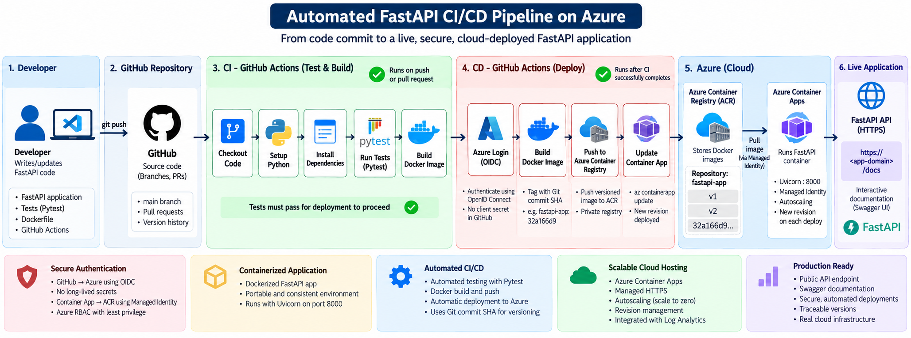
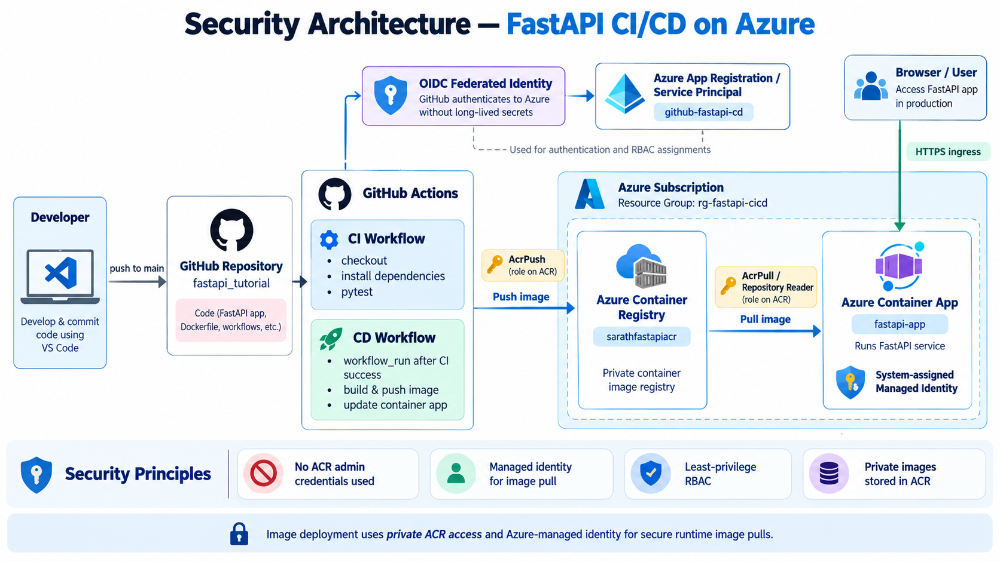
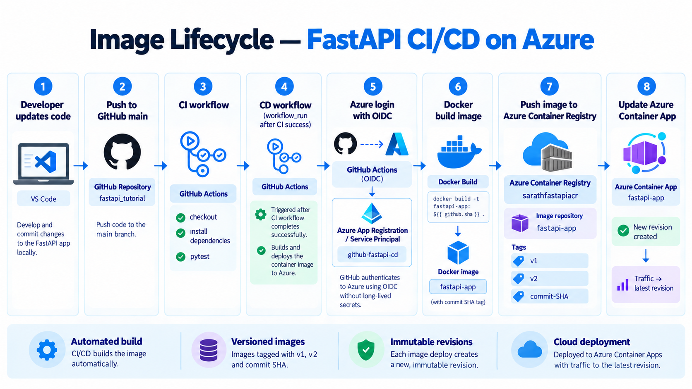
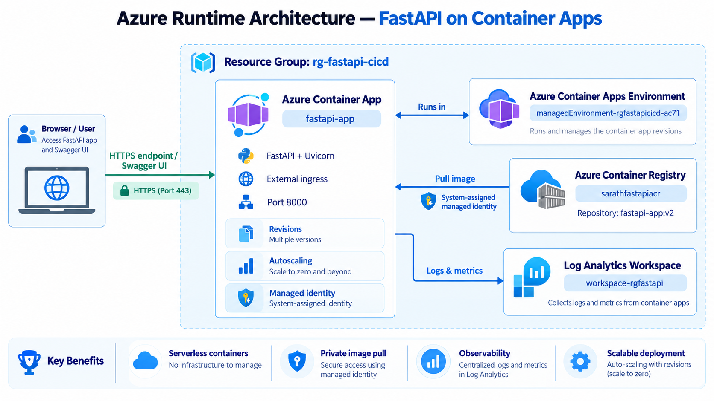
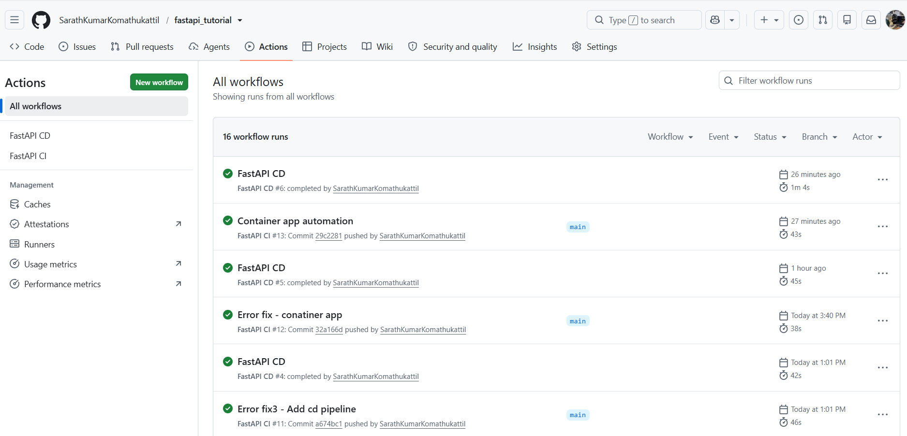
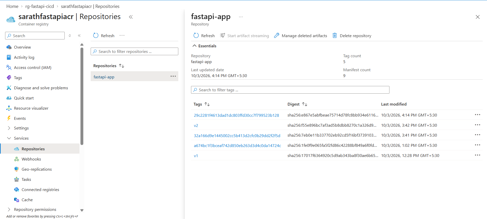
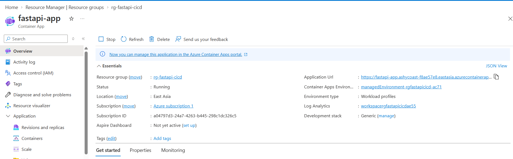
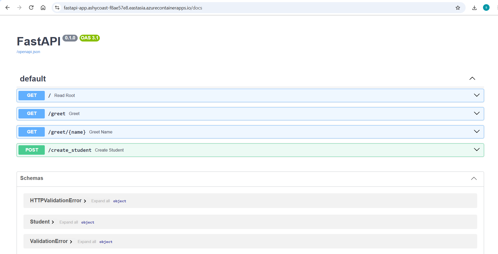

# FastAPI CI/CD Deployment on Azure

A production-style FastAPI application demonstrating **automated testing, Docker containerization, secure GitHub Actions CI/CD, Azure Container Registry, and deployment to Azure Container Apps**.

The primary goal of this project is to demonstrate how an application moves from:

**Source Code → Automated Testing → Containerization → Secure Cloud Deployment → Live API**

The project emphasizes **CI/CD automation, container deployment, cloud security, identity management, and production-style Azure workflows**.

---

## 🚀 Project Overview

This project started as a FastAPI application and was progressively converted into a tested, containerized, and cloud-deployed service.

The final solution includes:

- FastAPI REST API
- Pytest automated testing
- Docker containerization
- Git and GitHub
- GitHub Actions Continuous Integration
- GitHub Actions Continuous Deployment
- Microsoft Azure
- Azure Container Registry (ACR)
- Azure Container Apps
- OpenID Connect (OIDC)
- Microsoft Entra ID
- Federated Identity Credentials
- System-Assigned Managed Identity
- Azure RBAC
- Git SHA-based Docker image versioning
- Container App revisions
- Public HTTPS API
- FastAPI Swagger documentation

---

# 🔄 End-to-End CI/CD Architecture



The automated application delivery flow is:

```text
Developer
   ↓
Git Push
   ↓
GitHub Repository
   ↓
GitHub Actions CI
   ↓
Pytest
   ↓
Docker Build Verification
   ↓
CI Success
   ↓
GitHub Actions CD
   ↓
OIDC Authentication
   ↓
Docker Build
   ↓
Push to Azure Container Registry
   ↓
Update Azure Container App
   ↓
New Container App Revision
   ↓
Live FastAPI Application
```

---

# 🛠️ Technology Stack

| Area | Technology |
|---|---|
| Programming Language | Python |
| API Framework | FastAPI |
| API Server | Uvicorn |
| Testing | Pytest |
| Database ORM | SQLAlchemy |
| Database | MySQL |
| Authentication | JWT / OAuth2 |
| Containerization | Docker |
| Version Control | Git |
| Source Repository | GitHub |
| CI/CD | GitHub Actions |
| Cloud Platform | Microsoft Azure |
| Container Registry | Azure Container Registry |
| Application Hosting | Azure Container Apps |
| Deployment Authentication | OpenID Connect |
| Runtime Authentication | Managed Identity |
| Authorization | Azure RBAC |

---

# 📁 Project Structure

```text
fastapi_tutorial/
│
├── .github/
│   └── workflows/
│       ├── ci.yml
│       └── cd.yml
│
├── auth/
├── tests/
│
├── docs/
│   └── images/
│       ├── cicd-architecture.png
│       ├── security-architecture.png
│       ├── image-lifecycle.png
│       ├── azure-runtime-architecture.png
│       ├── github-actions-success.png
│       ├── acr-images.png
│       ├── container-app-running.png
│       └── swagger-cloud.png
│
├── main.py
├── crud.py
├── database.py
├── model.py
├── create_table.py
├── project.py
│
├── Dockerfile
├── requirements.txt
├── .gitignore
└── README.md
```

Sensitive values such as database credentials and application secrets are stored locally in `.env` and excluded from Git.

---

# ⚡ FastAPI Application

The application demonstrates common REST API development concepts including:

- GET endpoints
- POST endpoints
- PUT endpoints
- DELETE endpoints
- Path parameters
- Query parameters
- JSON request bodies
- Pydantic validation
- HTTP status codes
- Exception handling
- SQLAlchemy integration
- MySQL connectivity
- User authentication
- JWT authorization

FastAPI automatically provides interactive API documentation at:

```text
/docs
```

---

# 🧪 Automated Testing with Pytest

Automated tests are executed before deployment.

Testing concepts used include:

- Assertions
- `pytest.raises()`
- Parameterized tests
- Fixtures
- `yield` fixtures
- `conftest.py`
- FastAPI `TestClient`
- Monkeypatching
- Coverage

Example:

```python
def test_greet_name():
    response = client.get("/greet/sarath?age=25")

    assert response.status_code == 200

    assert response.json() == {
        "message": "Hey sarath, you are 25 years old"
    }
```

Run tests locally:

```bash
python -m pytest
```

Run with coverage:

```bash
python -m pytest --cov=app --cov-report=term-missing
```

---

# 🐳 Docker Containerization

The FastAPI application is packaged as a Docker image.

```dockerfile
FROM python:3.13-slim

WORKDIR /app

COPY requirements.txt /app/requirements.txt

RUN pip install --no-cache-dir -r requirements.txt

COPY . .

EXPOSE 8000

CMD ["uvicorn", "main:app", "--host", "0.0.0.0", "--port", "8000"]
```

The application runs inside the container using:

```text
Host: 0.0.0.0
Port: 8000
```

Build locally:

```bash
docker build -t fastapi-app .
```

Run locally:

```bash
docker run -p 8000:8000 fastapi-app
```

Then access:

```text
http://localhost:8000/docs
```

---

# ✅ Continuous Integration

The CI workflow runs automatically when code is pushed or a pull request is created.

The CI pipeline performs:

```text
Checkout Code
      ↓
Setup Python
      ↓
Install Dependencies
      ↓
Run Pytest
      ↓
Build Docker Image
```

Current CI workflow:

```yaml
name: FastAPI CI

on:
  push:
  pull_request:

jobs:
  test:
    runs-on: ubuntu-latest

    steps:
      - name: Checkout code
        uses: actions/checkout@v4

      - name: Setup Python
        uses: actions/setup-python@v5
        with:
          python-version: "3.13"

      - name: Install dependencies
        run: |
          python -m pip install --upgrade pip
          pip install -r requirements.txt
          pip install pytest httpx

      - name: Run tests
        run: python -m pytest

  build:
    needs: test
    runs-on: ubuntu-latest

    steps:
      - name: Checkout code
        uses: actions/checkout@v4

      - name: Build Docker image
        run: docker build -t fastapi-app .
```

The Docker build only runs after testing succeeds:

```yaml
needs: test
```

Therefore:

```text
Tests fail
   ↓
Pipeline stops

Tests pass
   ↓
Docker build proceeds
```

This prevents broken code from progressing to deployment.

---

# 🚀 Continuous Deployment

The CD workflow starts only after the CI workflow completes successfully.

It also verifies that the successful CI run came from a push to the `main` branch.

The deployment sequence is:

```text
CI Success
    ↓
Checkout Tested Commit
    ↓
OIDC Login to Azure
    ↓
Login to ACR
    ↓
Build Versioned Docker Image
    ↓
Push Image to ACR
    ↓
Update Azure Container App
    ↓
Create New Revision
```

Current CD workflow:

```yaml
name: FastAPI CD

on:
  workflow_run:
    workflows: ["FastAPI CI"]
    types: ["completed"]

permissions:
  contents: read
  id-token: write

env:
  REGISTRY_NAME: sarathfastapiacr
  REGISTRY_URL: sarathfastapiacr-f4cafqgcfve4f7cw.azurecr.io
  IMAGE_NAME: fastapi-app
  RESOURCE_GROUP: rg-fastapi-cicd
  CONTAINER_APP_NAME: fastapi-app

jobs:
  deploy:
    runs-on: ubuntu-latest

    if: >
      github.event.workflow_run.conclusion == 'success' &&
      github.event.workflow_run.event == 'push' &&
      github.event.workflow_run.head_branch == 'main'

    steps:
      - name: Checkout code
        uses: actions/checkout@v4
        with:
          ref: ${{ github.event.workflow_run.head_sha }}

      - name: Login to Azure
        uses: azure/login@v3
        with:
          client-id: ${{ secrets.AZURE_CLIENT_ID }}
          tenant-id: ${{ secrets.AZURE_TENANT_ID }}
          subscription-id: ${{ secrets.AZURE_SUBSCRIPTION_ID }}

      - name: Login to ACR
        run: az acr login --name ${{ env.REGISTRY_NAME }}

      - name: Build Docker image
        run: docker build -t ${{ env.REGISTRY_URL }}/${{ env.IMAGE_NAME }}:${{ github.event.workflow_run.head_sha }} .

      - name: Push Docker image
        run: docker push ${{ env.REGISTRY_URL }}/${{ env.IMAGE_NAME }}:${{ github.event.workflow_run.head_sha }}

      - name: Deploy to Container App
        run: az containerapp update --name ${{ env.CONTAINER_APP_NAME }} --resource-group ${{ env.RESOURCE_GROUP }} --image ${{ env.REGISTRY_URL }}/${{ env.IMAGE_NAME }}:${{ github.event.workflow_run.head_sha }}
```

---

# 🔐 Security Architecture



The project uses separate identities for **deployment** and **runtime access**.

## GitHub → Azure

GitHub Actions authenticates to Azure using **OpenID Connect (OIDC)**.

```text
GitHub Actions
      ↓
OIDC Token
      ↓
Microsoft Entra ID
      ↓
Federated Identity Credential
      ↓
Azure App Registration
      ↓
Azure Resources
```

The workflow requires:

```yaml
permissions:
  contents: read
  id-token: write
```

Azure login:

```yaml
- name: Login to Azure
  uses: azure/login@v3
  with:
    client-id: ${{ secrets.AZURE_CLIENT_ID }}
    tenant-id: ${{ secrets.AZURE_TENANT_ID }}
    subscription-id: ${{ secrets.AZURE_SUBSCRIPTION_ID }}
```

The repository stores only references to:

```text
AZURE_CLIENT_ID
AZURE_TENANT_ID
AZURE_SUBSCRIPTION_ID
```

No Azure client password is stored in the workflow.

---

# 🔑 Container App → ACR Authentication

The Azure Container App uses a **System-Assigned Managed Identity** to retrieve the private Docker image from Azure Container Registry.

```text
Azure Container App
        ↓
System-Assigned Managed Identity
        ↓
Azure RBAC
        ↓
Azure Container Registry
        ↓
Pull Docker Image
```

The Container App identity receives:

```text
Container Registry Repository Reader
```

This avoids storing an ACR username or password inside the application.

The ACR Admin account remains disabled.

---

# 🛡️ Azure RBAC

Different identities receive different permissions.

## GitHub Deployment Identity

The GitHub deployment identity needs permissions to:

```text
Push Docker images to ACR
Update Azure Container Apps
```

For the ABAC-enabled registry, image publishing uses:

```text
Container Registry Repository Writer
```

The deployment identity also receives the Azure permissions required to update the Container App.

## Container App Runtime Identity

The FastAPI Container App only requires permission to retrieve images:

```text
Container Registry Repository Reader
```

This separates deployment and runtime responsibilities and follows the principle of least privilege.

---

# 📦 Azure Container Registry

Docker images are stored inside a private Azure Container Registry.

```text
Registry:
sarathfastapiacr

Repository:
fastapi-app
```

Manual deployment testing created versioned images such as:

```text
fastapi-app:v1
fastapi-app:v2
```

Automated CD deployments use Git commit SHAs instead.

Example:

```text
fastapi-app:32a166d9...
```

---

# 🔄 Traceable Image Lifecycle



Each automated deployment uses the Git commit SHA as the Docker image tag.

```text
Git Commit
32a166d9
     ↓
Docker Build
     ↓
fastapi-app:32a166d9
     ↓
Azure Container Registry
     ↓
Azure Container App
     ↓
New Revision
```

The core idea is:

```text
Git Commit SHA
=
Docker Image Tag
=
Deployment Version
```

This improves:

- Traceability
- Reproducibility
- Deployment history
- Debugging
- Rollback capability
- Source-to-deployment mapping

---

# ☁️ Azure Runtime Architecture



The Azure infrastructure is organized inside:

```text
rg-fastapi-cicd
```

Main resources:

```text
rg-fastapi-cicd
│
├── Azure Container Registry
│   └── sarathfastapiacr
│       └── fastapi-app
│
├── Container Apps Environment
│
├── Azure Container App
│   └── fastapi-app
│
└── Log Analytics Workspace
```

The runtime flow is:

```text
Azure Container Registry
        ↓
Managed Identity Image Pull
        ↓
Azure Container App
        ↓
Uvicorn :8000
        ↓
HTTPS Ingress
        ↓
User / API Client
```

Azure Container Apps provides:

- Managed HTTPS
- Container hosting
- Autoscaling
- Scale-to-zero
- Revision management
- Traffic management
- Logging
- Public application endpoint

---

# 🤖 Automated Deployment

The final CD step updates the existing Container App to use the Docker image created from the successful Git commit.

```yaml
- name: Deploy to Container App
  run: az containerapp update --name ${{ env.CONTAINER_APP_NAME }} --resource-group ${{ env.RESOURCE_GROUP }} --image ${{ env.REGISTRY_URL }}/${{ env.IMAGE_NAME }}:${{ github.event.workflow_run.head_sha }}
```

Conceptually:

```text
Git Commit
     ↓
Docker Image
     ↓
ACR
     ↓
az containerapp update
     ↓
New Container App Revision
     ↓
Production Traffic
```

After the Azure infrastructure has been created, future application releases no longer require manual Docker build, push, or Container App image updates.

---

# 🏗️ Infrastructure vs Application Deployment

The project separates **infrastructure provisioning** from **application deployment**.

Infrastructure was initially created manually to understand each Azure resource.

Infrastructure includes:

```text
Azure Container Registry
Container Apps Environment
Container App
Managed Identity
RBAC
Log Analytics
```

Application deployment is automated through GitHub Actions:

```text
Test
 ↓
Build
 ↓
Version
 ↓
Push
 ↓
Deploy
```

In a larger production environment, infrastructure provisioning could also be automated using:

- Terraform
- Bicep
- ARM templates
- Dedicated infrastructure pipelines

---

# 🧯 Troubleshooting and Lessons Learned

Building the project involved troubleshooting several real cloud deployment issues.

## Azure CLI MFA

Azure CLI initially required explicit tenant authentication and MFA.

The active subscription was verified using:

```bash
az account show --output table
```

---

## GitHub OIDC Authentication

Initial GitHub Actions error:

```text
AADSTS70025:
The client has no configured federated identity credentials
```

The issue occurred because Microsoft Entra ID did not yet trust the GitHub repository.

It was resolved by configuring a **Federated Identity Credential** on the Azure App Registration.

---

## Azure RBAC Permissions

After OIDC authentication succeeded, the GitHub identity still required permission to access Azure resources.

Azure RBAC roles were assigned based on the operations required by the deployment workflow.

---

## ACR Repository Permissions

The Azure Container Registry uses the newer repository permission model.

Responsibilities were separated:

```text
Repository Writer
→ GitHub pushes images

Repository Reader
→ Container App pulls images
```

---

## Container App Image Pull Failure

The deployment initially failed with:

```text
UNAUTHORIZED: authentication required
Action: pull
```

The Container App was trying to retrieve a private ACR image without the required permission.

Resolution:

```text
Container App
      ↓
System-Assigned Managed Identity
      ↓
Container Registry Repository Reader
      ↓
ACR
```

---

## Uvicorn Startup Error

Container logs showed:

```text
Error: Got unexpected extra argument (8000)
```

The Dockerfile originally contained:

```dockerfile
CMD ["uvicorn", "main:app", "--host", "0.0.0.0", "8000"]
```

The missing `--port` argument was corrected:

```dockerfile
CMD ["uvicorn", "main:app", "--host", "0.0.0.0", "--port", "8000"]
```

A corrected Docker image was built and deployed as:

```text
fastapi-app:v2
```

---

## Container Apps Ingress

The temporary quickstart image listened on:

```text
80
```

The FastAPI/Uvicorn container listens on:

```text
8000
```

Azure Container Apps ingress was therefore configured with:

```text
Target Port: 8000
```

---

## Scale to Zero

Azure Container Apps can display:

```text
Scaled to 0
```

when there is no traffic.

This is expected behavior when minimum replicas are configured as zero.

When a request arrives, Azure can automatically start a replica.

---

# 📊 Deployment Evidence

## GitHub Actions

Successful CI/CD runs:



This demonstrates that both CI validation and CD deployment complete successfully.

---

## Azure Container Registry

Versioned Docker images stored in ACR:



The repository contains manual tags such as:

```text
v1
v2
```

and automated Git SHA tags generated by the CD pipeline.

---

## Azure Container App

Running Azure Container App:



This confirms:

```text
Application: fastapi-app
Status: Running
Environment: Azure Container Apps
Ingress: HTTPS
Target Port: 8000
```

---

## FastAPI Swagger UI

The deployed application exposes interactive Swagger documentation:



The Swagger UI confirms that the Dockerized API is publicly running through Azure Container Apps.

---

# 🎯 Key Engineering Concepts Demonstrated

This project demonstrates practical experience with:

- REST API development
- Python
- FastAPI
- Automated testing
- Pytest
- Docker
- Git
- GitHub
- GitHub Actions
- Continuous Integration
- Continuous Deployment
- Azure
- Azure Container Registry
- Azure Container Apps
- Microsoft Entra ID
- OpenID Connect
- Federated Identity Credentials
- Managed Identity
- Azure RBAC
- Secure container deployment
- Git SHA-based versioning
- Container revisions
- Cloud networking
- Logging
- Troubleshooting
- Production-style deployment workflows

---

# ✅ Final Result

The completed system provides an automated path from source code to a running cloud application.

```text
Developer
    ↓
GitHub
    ↓
Automated Testing
    ↓
Docker Build
    ↓
Versioned Container Image
    ↓
Azure Container Registry
    ↓
Azure Container Apps
    ↓
Public HTTPS Endpoint
    ↓
FastAPI Swagger UI
```

After the initial Azure infrastructure is provisioned, future application changes can automatically be:

```text
Tested
→ Containerized
→ Versioned
→ Published
→ Deployed
```

through GitHub Actions.

---

# 🔮 Future Improvements

Potential extensions include:

- Application Insights
- Azure Monitor
- Advanced Log Analytics dashboards
- Health checks
- Automated deployment verification
- Automatic rollback
- Staging and production environments
- Azure Key Vault
- Infrastructure as Code
- Terraform
- Bicep
- MLflow
- Azure Machine Learning
- Model monitoring
- Model evaluation
- Continuous Training
- Model quality gates
- Kubernetes
- Azure Kubernetes Service

---

# 📚 What I Learned

This project provided hands-on experience with the complete application delivery lifecycle:

```text
Code
→ Test
→ Package
→ Authenticate
→ Publish
→ Deploy
→ Run
→ Troubleshoot
```

It demonstrated how different engineering tools work together:

```text
GitHub
→ Source control

Pytest
→ Automated quality validation

Docker
→ Application packaging

GitHub Actions
→ CI/CD automation

OIDC
→ Secure deployment authentication

Azure Container Registry
→ Private image storage

Managed Identity
→ Secure runtime authentication

Azure Container Apps
→ Cloud container execution

Log Analytics
→ Cloud logging and observability
```

The project demonstrates how **application development, DevOps, cloud infrastructure, identity, security, containerization, and deployment automation** can be combined into a complete end-to-end workflow.

---

## Author

**Sarath Kumar Komathukattil**

AI/ML | Applied AI | MLOps | Cloud | Robotics
